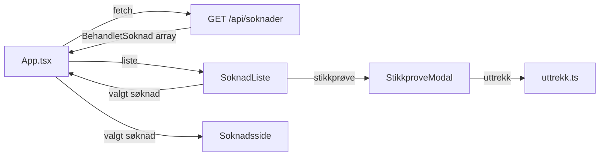

# fagprove-frontend-sandra

Frontend for forenklet saksbehandlingssystem for foreldrepenger. Viser søknader i en tabell og detaljer for hver sak inkludert vedtaksresultat. Bygget med React, TypeScript og NAVs designsystem (Aksel).

## Teknologier

| Teknologi        | Versjon | Formål                                                  |
| ---------------- | ------- | ------------------------------------------------------- |
| React            | 19      | UI-rammeverk med gjenbrukbare komponenter               |
| TypeScript       | 6       | Typesikkerhet                                           |
| Vite             | 8       | Byggverktøy med rask oppstart og HMR                    |
| @navikt/ds-react | 8       | NAVs designsystem (Aksel) for tilgjengelige komponenter |
| pnpm             | -       | Pakkehåndterer                                          |
| Vitest           | 4       | Testrammeverk bygd for Vite                             |

## Arkitektur

Appen er en single-page application uten ruter. Tilstanden styres i `App.tsx` som bytter mellom to visninger:

- **SoknadListe** — tabell med alle søknader, paginering (5 per side) og stikkprøvekontroll
- **Soknadsside** — detaljvisning med søknadsdetaljer, vedtaksdetaljer og inntektshistorikk

Navigasjon mellom visningene bruker state i `App.tsx` i stedet for React Router, siden appen bare har to visninger. Pagineringsstaten beholdes når man går tilbake fra en sak.

### Mappestruktur

```
src/
├── App.tsx                  # Rotkomponent med tilstandsstyring
├── main.tsx                 # Inngangspunkt, rendrer App
├── api/
│   ├── api.ts               # API-kall mot backend (GET /api/soknader)
│   └── types.ts             # TypeScript-typer for søknad, vedtak og inntekt
├── components/
│   ├── Felt.tsx              # Gjenbrukbar label/verdi-komponent
│   ├── Inntektshistorikk.tsx # Tabell med inntektshistorikk
│   ├── SoknadInfo.tsx        # Samler søknads- og vedtaksdetaljer
│   ├── Soknadsdetaljer.tsx   # Viser søknadsfelt i grid
│   ├── StikkproveModal.tsx   # Modal for stikkprøvekontroll
│   ├── Vedtaksdetaljer.tsx   # Viser vedtaksinfo basert på type
│   └── VedtakTag.tsx         # Fargekodet tag for vedtakstype
├── pages/
│   ├── SoknadListe.tsx       # Søknadsoversikt med tabell og paginering
│   └── Soknadsside.tsx       # Detaljside for en søknad
└── utils/
    ├── uttrekk.ts            # Logikk for proporsjonalt stikkprøveutvalg
    └── uttrekk.test.ts       # Tester for uttrekkslogikken
```

### Dataflyt



### Kommunikasjon med backend

Frontend kommuniserer med backend via ett REST-endepunkt:

| Metode | Endepunkt       | Beskrivelse                     |
| ------ | --------------- | ------------------------------- |
| GET    | `/api/soknader` | Henter alle behandlede søknader |

I utvikling proxyes `/api`-kall til `http://localhost:8080` via Vite sin dev-server (konfigurert i `vite.config.ts`). Hvis backenden er nede vises en feilmelding.

### Vedtakstyper

Vedtakene vises med fargekodede tags (`VedtakTag`-komponenten):

| Vedtakstype       | Aksel-variant |
| ----------------- | ------------- |
| Innvilget         | `success`     |
| Avslag            | `error`       |
| Manuell vurdering | `warning`     |
| Engangsstønad     | `info`        |

### Stikkprøvekontroll

Stikkprøvekontrollen åpnes som en modal fra søknadslisten. Uttrekksfunksjonen (`genererUttrekk` i `uttrekk.ts`) gjør et proporsjonalt utvalg: søknadene grupperes etter vedtakstype med `Object.groupBy`, og den angitte prosenten trekkes ut tilfeldig fra hver gruppe. Dette sikrer at alle vedtakstyper er proporsjonalt representert.

Modalen har validering av input (1–100), viser «Trukket ut X av Y saker» og har Chips for filtrering på vedtakstype. Ved avrunding kan det totale antallet avvike noe fra den oppgitte prosenten.

## Kjøre lokalt

Forutsetninger: Node.js og pnpm.

```bash
pnpm install
pnpm dev
```

Backend må kjøre på port 8080 for at API-kall skal fungere.

## Bygge

```bash
pnpm build
```

## Tester

```bash
pnpm test
```

Tester for uttrekkslogikken (`uttrekk.test.ts`):

- Proporsjonalt uttrekk per vedtakstype
- Lav prosent gir tomt resultat
- 100% returnerer alle saker
